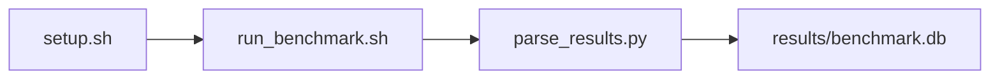

# RAG Pipeline Sweep Benchmark

[](LICENSE)
[](https://github.com/garys-gpu-benchmarks/432-gpu-bench-nvidia-rag-faiss-end2end-ubu2604/actions/workflows/ci.yml)

Target: Ubuntu 26.04 · NVIDIA · see Hardware Requirements. This is a host benchmark, not a laptop `pip install` project.

## Quick Start

```bash
git clone https://github.com/garys-gpu-benchmarks/432-gpu-bench-nvidia-rag-faiss-end2end-ubu2604.git
cd 432-gpu-bench-nvidia-rag-faiss-end2end-ubu2604
sudo bash setup.sh --assume-yes
bash run_benchmark.sh --profile smoke --validate
```
Results are written to `results/benchmark.db` and `results/summary.json`.

This workload is executed on the validation host after the repository is copied there. `setup.sh` and `run_benchmark.sh` do not open an outbound SSH session.

Prerequisites: Ubuntu 26.04; NVIDIA; Python 3.14.4; root or sudo for `setup.sh`. Framework: Bash, SQLite, Python, PyYAML, CUDA Runtime, PyTorch-CUDA, Hugging Face Transformers, Mistral-7B-v0.3, FAISS, LlamaIndex, BGE embed/rerank, squad_v2, Hugging Face Datasets, huggingface_hub, NumPy, llama_index. This is a host benchmark, not a laptop `pip install` project.



## 1. Overview

Runs scripts/gpu-bench-rag-faiss-end2end.py: load rajpurkar/squad_v2, embed with BAAI/bge-small-en-v1.5, search FAISS IndexFlatIP, rerank with BAAI/bge-reranker-base, and generate with mistralai/Mistral-7B-v0.3 for the yaml query_count. output_format: csv Sweep dimensions: corpus_dataset, chunk_size, chunk_overlap, embedding_model, vector_db, llm_model, reranker_model, retrieval_strategy.

## 2. What It Validates

- Validates squad_v2 retrieval plus BGE embedding, FAISS search, reranking, and Mistral generation for the yaml query count
- #1: E2E, ms (end_to_end_query_latency_retrieval_generation_ms); is present and physically sensible.
- #2: Generation TTFT, ms (generation_phase_time_to_first_token_ms); is present and physically sensible.
- #3: Retrieval latency (retrieval_latency_vector_search_ms); is present and physically sensible.
- #4: Gen throughput, tok/s (generation_throughput_output_tokens_s); is present and physically sensible.
- #5: Embedding throughput (embedding_throughput_docs_s); is present and physically sensible.
- #6: FAISS index vectors (faiss_index_ntotal) is present and physically sensible.

## 3. Metrics Captured

- **#1: E2E, ms** — stored as `end_to_end_query_latency_retrieval_generation_ms`.
- **#2: Generation TTFT, ms** — stored as `generation_phase_time_to_first_token_ms`.
- **#3: Retrieval latency** — stored as `retrieval_latency_vector_search_ms`.
- **#4: Gen throughput, tok/s** — stored as `generation_throughput_output_tokens_s`.
- **#5: Embedding throughput** — stored as `embedding_throughput_docs_s`.
- **#6: FAISS index vectors** — stored as `faiss_index_ntotal`.

## 4. Hardware Requirements

### Supported environment

- OS: Ubuntu 26.04
- GPU vendor: NVIDIA
- Framework family: Bash, SQLite, Python, PyYAML, CUDA Runtime, PyTorch-CUDA, Hugging Face Transformers, Mistral-7B-v0.3, FAISS, LlamaIndex, BGE embed/rerank, squad_v2, Hugging Face Datasets, huggingface_hub, NumPy, llama_index
- Python: Python 3.14.4

### Reference validation environment

The tables below describe the machine used to generate the reference results. They are not a requirement that every user buy that exact cloud instance.

### System

Runs scripts/gpu-bench-rag-faiss-end2end.py: load rajpurkar/squad_v2, embed with BAAI/bge-small-en-v1.5, search FAISS IndexFlatIP, rerank with BAAI/bge-reranker-base, and generate with mistralai/Mistral-7B-v0.3 for the yaml query_count. output_format: csv

### GPU

Ubuntu 26.04 / NVIDIA / Bash, SQLite, Python, PyYAML, CUDA Runtime, PyTorch-CUDA, Hugging Face Transformers, Mistral-7B-v0.3, FAISS, LlamaIndex, BGE embed/rerank, squad_v2, Hugging Face Datasets, huggingface_hub, NumPy, llama_index

## 5. Software Requirements

| Component | Version |
|---|---|
| OS | Ubuntu 26.04 |
| Kernel | kernel 7.0.0 |
| Python | Python 3.14.4 |
| ROCm | CUDA 13.3 |
| rocBLAS | N/A - rocBLAS not used |

Runs scripts/gpu-bench-rag-faiss-end2end.py: load rajpurkar/squad_v2, embed with BAAI/bge-small-en-v1.5, search FAISS IndexFlatIP, rerank with BAAI/bge-reranker-base, and generate with mistralai/Mistral-7B-v0.3 for the yaml query_count. output_format: csv

## 6. Installation

```bash
Run scripts/gpu-bench-rag-faiss-end2end.py for squad_v2 retrieval, BGE embeddings, FAISS search, and Mistral generation
```

## 7. Running the Benchmark

```bash
Run scripts/gpu-bench-rag-faiss-end2end.py for squad_v2 retrieval, BGE embeddings, FAISS search, and Mistral generation
```

**Validating results separately:**

```bash
export BENCHMARK_PYTHON=/usr/bin/python3.13  # optional
python3 -m venv .venv
source ".venv/bin/activate"
".venv/bin/python" scripts/validate_results.py
```

## 8. Output

### `results/benchmark.db` (SQLite)

raw_results.csv with pass1, pass2, and summary copies of the same aggregate, plus queries.csv with one row per measured query

check_name,end_to_end_query_latency_retrieval_generation_ms,generation_phase_time_to_first_token_ms,retrieval_latency_vector_search_ms,faiss_index_ntotal,generation_throughput_output_tokens_s,embedding_throughput_docs_s,index_backend,corpus_docs,chunk_count,query_count,chunk_overlap
summary,700,100,2.0,200,45,180,1,40,200,8,20

```bash
Run scripts/gpu-bench-rag-faiss-end2end.py for squad_v2 retrieval, BGE embeddings, FAISS search, and Mistral generation
```

### `results/summary.json`

Consolidated metrics from the most recent run — suitable for CI artifact upload or dashboard ingestion.

### `results/raw/<timestamp>.txt`

raw_results.csv with pass1, pass2, and summary copies of the same aggregate, plus queries.csv with one row per measured query

check_name,end_to_end_query_latency_retrieval_generation_ms,generation_phase_time_to_first_token_ms,retrieval_latency_vector_search_ms,faiss_index_ntotal,generation_throughput_output_tokens_s,embedding_throughput_docs_s,index_backend,corpus_docs,chunk_count,query_count,chunk_overlap
summary,700,100,2.0,200,45,180,1,40,200,8,20

## 9. Baselines / Thresholds

Expected ranges and gates live in `config/benchmark_config.yaml` under `baselines:` or `thresholds:`. To update them, edit that file — never edit validation code directly.

## 10. Troubleshooting

**`setup.sh` missing collector**
Create cannot finish without `scripts/collect_workload.py`.

**`self_check` overlay rewritten**
Do not overwrite files listed in `results/overlay_lock.json`.

**Remote SSH drop during setup**
Reconnect and resume `bash setup.sh --assume-yes`. Do not wipe `.venv` or `.cache`.

## 11. NVIDIA H100 Coding Differences

Native NVIDIA CUDA workload. Execute on the stated Ubuntu release with the host NVIDIA driver and CUDA userspace. ROCm porting notes do not apply.

## Repository layout

```text
.
├── setup.sh
├── run_benchmark.sh
├── benchmark_specification.json
├── .github/workflows/      # thin CI callers (see Continuous Integration)
├── config/
├── scripts/
├── src/
├── tests/
├── docs/
├── results/
└── LICENSE
```

## Continuous Integration

| Workflow | Runs on | When | What it does |
|---|---|---|---|
| [CI](.github/workflows/ci.yml) | GitHub-hosted runner | every pull request, and every push to `main` | shellcheck, ruff, `bash -n`, `compileall`, `run_benchmark.sh --help`, specification schema, the results validator on a seeded fixture, required files, and actionlint. No GPU and no benchmark run. |
| [GPU Smoke Benchmark](.github/workflows/gpu-smoke.yml) | self-hosted runner labeled `gpu`, `nvidia`, `ubu2604` | only when started by hand: **Actions → GPU Smoke Benchmark → Run workflow** (choose `smoke`, `baseline` or `extended`) | Verifies the pre-provisioned GPU stack, records `results/environment.json` (driver, runtime, kernel, GPU), runs the profile with `--validate`, shows headline metrics on the run page, and uploads the results. |

Both files are short callers. The steps themselves live once, for every workload in the suite, in [`garys-gpu-benchmarks/shared-workflows`](https://github.com/garys-gpu-benchmarks/shared-workflows), pinned at `@v1`. The GPU workflow is never triggered by pull requests, so code from a fork cannot run on the GPU host.

### Running it as part of the NVIDIA Ubuntu 26.04 bundle

This repository is one of the 32 workloads in [`bundle-nvidia-ubuntu-2604`](https://github.com/garys-gpu-benchmarks/bundle-nvidia-ubuntu-2604), which holds them as git submodules. To put the whole bundle on a GPU host and run this workload from it:

```bash
git clone --recurse-submodules https://github.com/garys-gpu-benchmarks/bundle-nvidia-ubuntu-2604 /opt/benchmarks
cd /opt/benchmarks/432-gpu-bench-nvidia-rag-faiss-end2end-ubu2604
bash run_benchmark.sh --profile smoke --validate
```
